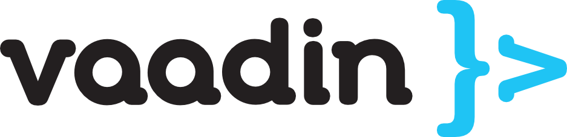

# Proyecto_Gasolinera

Este trabajo presenta el desarrollo de un sistema informático para automatizar los procesos operativos en una gasolinera, con el objetivo de mejorar la gestión de pagos, el control de inventario, la emisión de facturas simuladas y la planificación de abastecimiento. 

## Diagrama UML

## Dirección de los códigos.
- [Models.](https://github.com/vivinaCordova/Proyecto_Gasolinera/tree/main/unl-gasolinera/src/main/java/org/unl/gasolinera/base/models)
- [Daos.](https://github.com/vivinaCordova/Proyecto_Gasolinera/tree/main/unl-gasolinera/src/main/java/org/unl/gasolinera/base/controller/dao/dao_models)
- [Services.](https://github.com/vivinaCordova/Proyecto_Gasolinera/tree/main/unl-gasolinera/src/main/java/org/unl/gasolinera/base/controller/service)

## Tecnologías
### Framework Vaadin

  

Vaadin Flow (antes conocido como Vaadin Framework) es un marco web Java destinado a la creación de aplicaciones y páginas web.  Su modelo de programación facilita a los programadores el uso de Java como lenguaje de programación para la implementación de interfaces de usuario (UI), evitando la necesidad de emplear HTML o JavaScript de manera directa.

### Java 17

  

Java 17 fue lanzado en septiembre de 2021 y es una versión con soporte a largo plazo (LTS) del lenguaje de programación Java que incorpora numerosas nuevas características, mejoras y optimizaciones que ofrecen un mejor rendimiento, funciones de lenguaje modernas, actualizaciones de seguridad y estabilidad a largo plazo.

